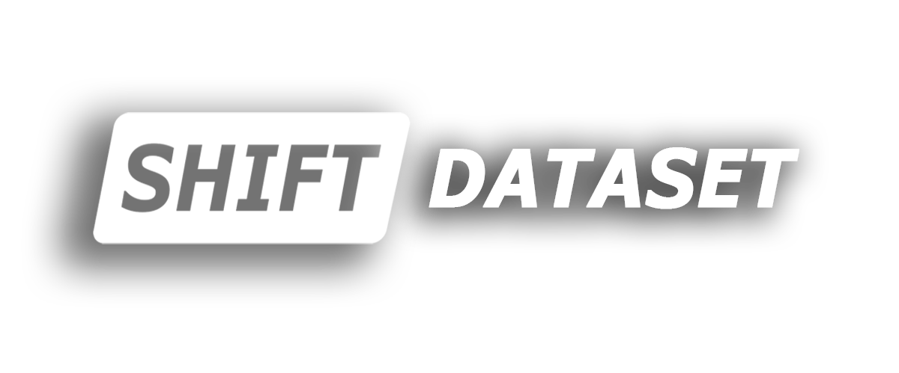

<div align="center">
  
  <div>&nbsp;</div>
  <div align="center">
    <a href="https://www.vis.xyz/shift/">
    <b><font size="5">[SHIFT Project Page]</font></b>
    </a>
    &nbsp;&nbsp;&nbsp;&nbsp;
    <a href="https://go.yf.io/shift-paper">
    <b><font size="5">[SHIFT Paper (CVPR 2022)]</font></b>
    </a>
    &nbsp;&nbsp;&nbsp;&nbsp;
    <a href="https://www.vis.xyz/">
    <b><font size="5">[VIS Group]</font></b>
    </a>
  </div>
  <div>&nbsp;</div>
</div>

## Introduction

[SHIFT](https://www.vis.xyz/shift/) is a driving dataset for continuous multi-task domain adaptation. It is maintained by the [VIS Group](https://www.vis.xyz/) at ETH Zurich.

The main branch works with **PyTorch1.6+**.

<div align="center">
  
</div>

## Tutorial
### Get started

Please refer to [get_started.md](docs/get_started.md) for install instructions.

### Prepare the SHIFT dataset

Please refer to [dataset_prepare.md](docs/dataset_prepare.md) for instructions on how to download and prepare the SHIFT dataset.

### Usage

Please refer to [train_test.md](docs/train_test.md) for instructions on how to train and test your own model.

### Participate in the Challenge on Continual Test-time Adaptation for Object Detection

Please refer to [challenge.md](docs/challenge.md) for instructions on how to participate in the challenge and for training, test, and adaptation instructions.

The challenge is organized for the Workshop on [Visual Continual Learning @ ICCV2023](wvcl.vis.xyz). Checkout [wvcl.vis.xyz/challenges](https://wvcl.vis.xyz/challenges) for additional details on the challenge. 

We will award the top three teams of each challenge with a certificate and a prize of 1000, 500, and 300 USD, respectively. The winners of each challenge will be invited to give a presentation at the workshop. Teams will be selected based on the performance of their methods on the test set.

We will also award one team from each challenge with an innovation award. The innovation award is given to the team that proposes the most innovative method and/or insightful analysis. The winner will receive a certificate and an additional prize of 300 USD.

# Challenge on Continual Test-time Adaptation for Object Detection

## Model zoo

Results and models are available in the [model zoo](docs/model_zoo.md).

### Object Detection

Supported Adaptation Methods
- [x] [no_adap](configs/continuous/no_adap_yolox)
- [x] [mean_teacher_adapter_yolox](configs/continuous/mean_teacher_adapter_yolox)

Supported Datasets

- [x] [SHIFT](https://www.vis.xyz/shift/)


## Citation

If you find this project useful in your research, please consider citing:

```latex
@inproceedings{sun2022shift,
  title={SHIFT: a synthetic driving dataset for continuous multi-task domain adaptation},
  author={Sun, Tao and Segu, Mattia and Postels, Janis and Wang, Yuxuan and Van Gool, Luc and Schiele, Bernt and Tombari, Federico and Yu, Fisher},
  booktitle={Proceedings of the IEEE/CVF Conference on Computer Vision and Pattern Recognition},
  pages={21371--21382},
  year={2022}
}
```

## License

This project is released under the [MIT License](LICENSE).
